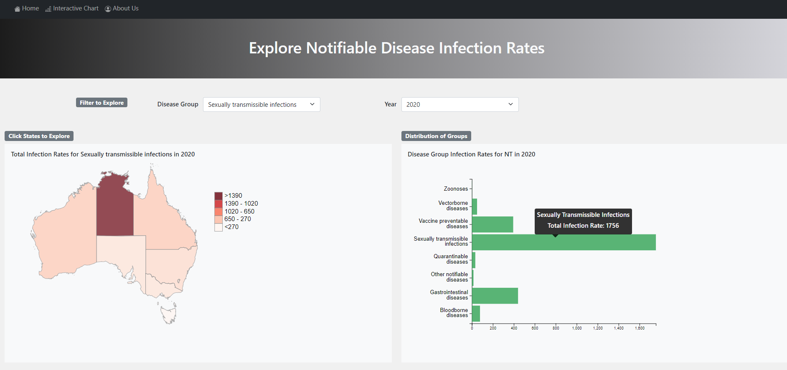
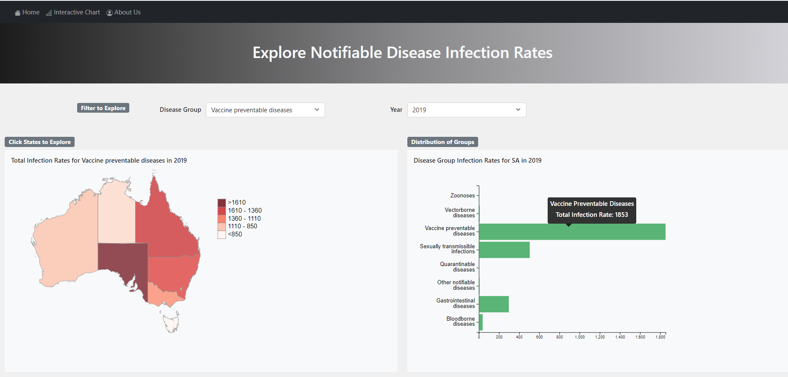
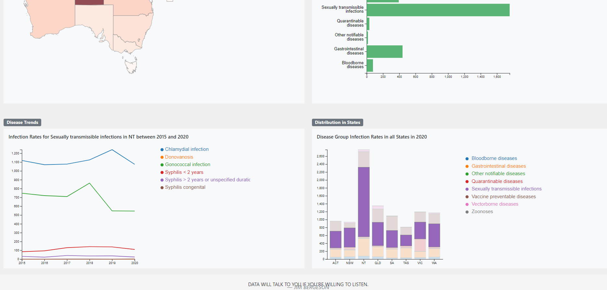
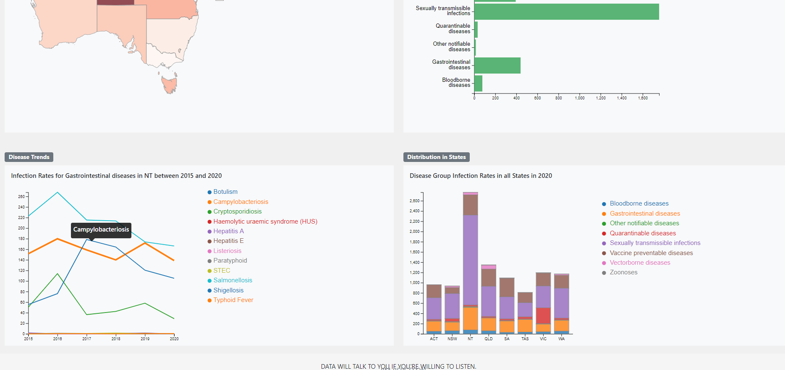
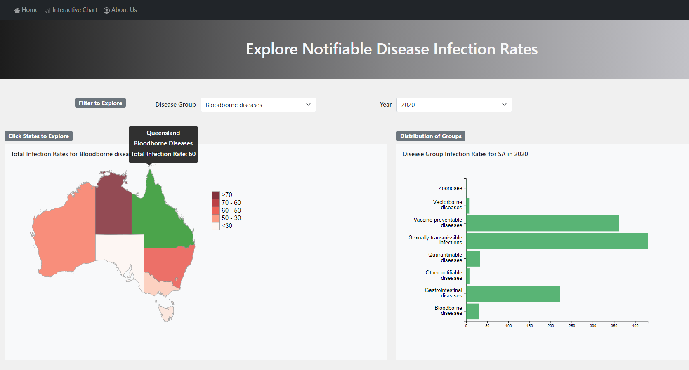

# Visualising Data from the National Notifiable Diseases Surveillance System for Strategic Improvements to Health Outcomes


## Introduction

The aim of this project was to investigate data from the National Notifiable Disease Surveillance System (NNDSS) and establish 
what trends could be observed.

Data between 2015 and 2020 on infection rates per 100,000 people was extracted from the website, transformed into a comparable dataset and loaded into an SQLite database.

An SQLAclhemy/Flask API was created to allow data to be used in a D3.js web application that was launched on Heroku.

The application consists of an interactive dashboard of four visualisations depicting comparisons of infection rates across disease groups, states and territories and years.


## Structure
```
project 
|__ static/                 
|   |__ css/                
|   |   |__ d3Style.css             # style sheet 
|   |   |__ style.css               # style sheet 
|   |   
|   |__ data/                       # data folder
|   |__ js/
|       |__ app.js                  # javascript file
|       |__ icon.js                 # javascript file
|
|__ templates/   
|    |__ about.html                 # html file
|    |__ home.html                  # html file
|    |__ index.html                 # html file
|
|__ .gitignore
|
|__ app.py                          # flask-sqlachemy app to launch website an api
|
|__ diseases.sqlite                 # database
|
|__ Webscrape and database.ipynb    # webscraping notebook and creation of database

```

## Usage

```
The page was created using:
- HTML5
- Bootstrap 5.0.2
- Javascript ES6
- D3.js V4
- SQL Alchemy
- python 3.8.5
- pandas 1.2.4
- splinter 0.14.0
- webdriver_manger 3.4.2
- flask 1.1.2
- sqlite
- gnuicorn
- heroku

Two additional d3 extensions utilised were:
- D3 Geoprojection (https://github.com/d3/d3-geo)
- D3 Colour Scales (https://github.com/d3/d3-scale-chromatic)

```

## Questions 

1. Which states are experiencing the highest infection rates by disease group?
2. Which disease groups are occurring most frequently?
3. How are the rates progressing over time?
4. How can our application be implemented? 


## Datasets 

|No.|Source|Link|
| -|-|-|
|1|National Notifiable Diseases Surveillance System |http://www9.health.gov.au/cda/source/cda-index.cfm|
|1|Australian Sates GeoJSON |https://github.com/tonywr71/GeoJson-Data/blob/master/australian-states.min.geojson|


## Analysis

### Question 1: Which states are experiencing the highest infection rates? 



The Northern Territory experienced the highest infection rates in Bloodborne Diseases, Gastrointestinal Dieaseses and Vectorborne Diseases across the majority of years. 
Notably Sexually Transmissable Infections were several magnitudes higher than the rest of Australia. The Northern Territory's Sexual Health and Bloodborne Viruses Unit (https://health.nt.gov.au/professionals/centre-for-disease-control/cdc-programs-and-units/sexual-health-and-blood-borne-viruses)
supports the delivery of educational and clinical services across the NT however this data may indicate gaps in these services.

Vectorborne disease rates were also high in Queensland and overtook NT in 2020. These are generally the mosquitoborne Ross River Virus and Dengue Fever and is not an unusual occurance in hot, humid climates.

Zoonoses has low infection rates across Australia and it's occurance is effectively limited to Queensland. Leptospirosis is the key disease in this group and is mainly associated with exposure to rodent urine
in agricultural workers.



South Australia experiences a higher rate of Vaccine Preventable Diseases compared with other States and Territories.


### Question 2: Which disease groups are occurring most frequently? 



The most frequently occuring disease groups across Australia were Sexually Transimissable Infections, Vaccine Preventable Diseases and Gastrointestinal Diseases.

Key diseases from each group were:
- Sexually Transimissable Infections
	- Chlamydial Infection
	- Gnonoccal Infection
- Gastrointestinal Infections
	- Salmonellosis
	- Campylobacteriosis
	- Cryptosporidiosis
- Vaccine Preventable Diseases
	- Influenza
	- Varicella Zoster (Shingles)

### Question 3: How are the rates progressing over time? 



In general disease rates across all groups are decreasing over time. Of the Vaccine Preventable Diseases, 
Shingles has a constistant trend, whereas Influenza experiences distinctive spikes (2017 and 2019). 2020 experienced a record low of infection rates across Australia

Sexually Transmissable Infections have experienced increases over time, especially Chlamydia. However, in 2020 there was a marked decline infections.


### Question 4: How can our application be implemented? 



The aim of our application is to provide an interactive dashboard that can allow users to have control over how they view the dataset while gaining meaningful insights into the data.
The target audience would be health advisors who require rapid, highlevel information to guide strategic interventions to deliver improved public health outcomes.


## Summary

Our analysis indicates that sexual health and hygiene, vaccine programs and food safety and hygiene are key areas that require improvement to minimise observed infection rates.
It was also observed that COVID-19 related increased hygiene practices, restricted movements and physical distancing may have had an impact in the reduction of many disease infection rates in 2020.

Incorporation of other statistics including infections by age group, socio-economic indexes for areas and other related data into the analysis would enable a reconstructive analysis
to identify key risk factors and establish early interventions.
  
This webpage provides a dashboard that can be manipulated by the user to view trends in the infection rates across the States and Territories, through all disease groups and over time.
The filters and interactions can provide a high level overview of the data as well as a more granular analysis. This allows the user to experience a greater control over their interpretation 
of the data set while still highlighting key areas that require additional interventions.


## Contributors

- [@AminSundrani](https://github.com/AminSundrani)
- [@FernB](https://github.com/FernB)
- [@hide-890302](https://github.com/hide-890302)
- [@Bec-Gould](https://github.com/Bec-Gould)